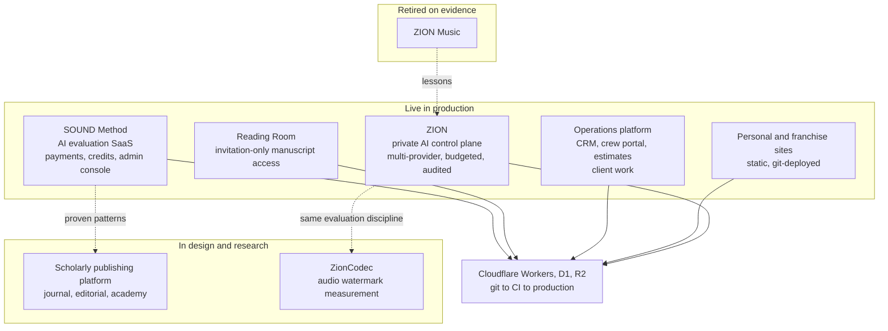

# Engineering Portfolio

**Bruno Miranda** · AI product engineer · edge computing · full-stack SaaS
Musician, worship theologian, author and educator, which is why the systems I build are honest, legible and kind to the people using them.

[brunomiranda.net](https://brunomiranda.net) · [lumensound.org](https://lumensound.org) · [Contact](https://brunomiranda.net/contact)

---

## In one paragraph

I design, build and operate production software alone: AI-integrated SaaS, payments, private document access, operations platforms and my own AI control plane, all on Cloudflare's edge. The constraint of being the only engineer shapes everything. I choose boring infrastructure, make every failure typed and traceable, write down every decision with the alternatives that lost, and ship only through git. I came to this from twenty-plus years of music and ministry; the engineering grew out of building tools for problems I understood from the inside.

> **Short on time?** Read the [SOUND Method case study](case-studies/sound-method.md) (production, money, AI, incidents) and [How I work](docs/how-i-work.md). Ten minutes covers the whole picture.

---

## The ecosystem at a glance

---

## Case studies

| | Project | What to look for | Status |
|---|---|---|---|
| 1 | **[SOUND Method](case-studies/sound-method.md)** | System and sequence diagrams, ER model, payment webhook design, incident ledger, deploy discipline | Live beta |
| 2 | **[ZION: a private AI control plane](case-studies/zion-control-plane.md)** | Provider abstraction, routing, spend cap, permission levels, blind model evaluation, epistemic labels | Live, single user |
| 3 | **[Operations platform and web properties](case-studies/operations-and-web-properties.md)** | Three-audience architecture, two auth models, guarded public intake | Live, client work |
| 4 | **[Scholarly publishing platform (design)](case-studies/lumen-sound-platform-design.md)** | Protected decisions, verifiable peer-review badges, rules written before code | In design |
| 5 | **[ZionCodec: audio watermark research](case-studies/zioncodec-research.md)** | A claims policy that forbids overclaiming; frozen attacks; publish-the-failures | Pre-build |
| 6 | **[Retired, not forgotten: ZION Music](case-studies/zion-music-retired.md)** | How and why I closed an experiment on evidence | Closed Sept 2026 |

Cross-cutting: **[Engineering decisions](docs/engineering-decisions.md)** (what I chose, what lost, what it cost) · **[How I work](docs/how-i-work.md)** (how I think, how I like results delivered).

---

## Principles, with receipts

| Principle | Where it shows up |
|---|---|
| **Diagnosis before prescription.** Name what is broken and why before changing anything. | A 15% failure rate turned out to be a token cap, not the model. A dead webhook turned out to be a missing route registration. |
| **Git is the only path to production.** | One manual deploy caused a regression; it is now a rule in every project. |
| **Make the failure visible.** | Typed error codes, a cost record even for failed calls, an audit row even for denied tool calls. |
| **Claims no bigger than the evidence.** | Research rules that forbid "unremovable", "robust" and "first". Status pages that separate *tests pass* from *observed live*. |
| **Security is structure, not wording.** | Permission levels in a registry, not a prompt. Uploaded files can inform a model but never instruct it. |
| **Stop on evidence.** | A funded experiment closed, deleted and written up as soon as the data said no. |
| **Documentation is a discipline.** | Every repository carries an operating manual, architecture document, changelog and decision records. |

---

## Stack

| Layer | Tools |
|---|---|
| **Runtime and data** | Cloudflare Workers · D1 (SQLite at the edge) · R2 · Workers Assets · Cron Triggers · AI Gateway · Access |
| **AI** | Anthropic Claude API · OpenAI · Workers AI · prompt caching · typed output parsing · blind evaluation design |
| **Payments and messaging** | Paddle (merchant of record) · Resend · webhooks with signature verification and idempotency |
| **Front end** | Vanilla JavaScript · semantic CSS tokens · dark mode · PWA and service workers · mobile-first shells · pdfmake |
| **Languages** | JavaScript · TypeScript · Python · SQL |
| **Delivery** | Git · GitHub Actions · Workers Builds · wrangler · Miniflare tests · migration, rollback and verify scripts |
| **Practice** | ADRs · post-mortems · regression tests · `CLAUDE.md` operating manuals · spend caps · threat models |

---

## Research and ideas

The threads I keep returning to:

1. **Models are replaceable; the institution around them is not.** What should a personal AI environment own (identity, context, policy, budget, audit) so that any model can be swapped in?
2. **Epistemic labels for machine output.** Can a system be made to say *observed*, *derived*, *inferred* or *unknown*, and mean it? ([ZION](case-studies/zion-control-plane.md))
3. **Verifiable trust marks.** A peer-review badge should be computed from records, not attached as artwork. ([Publishing platform](case-studies/lumen-sound-platform-design.md))
4. **Provenance for finished audio.** How much of a watermark survives real distribution and neural re-synthesis, and what do a signed record and stream metadata add when it fails? ([ZionCodec](case-studies/zioncodec-research.md))
5. **AI and formation.** In teaching, the output of a tool is worth little; the quality of the direction behind it is the evidence of understanding. I design assessment around that.
6. **How the songs a congregation sings shape what it believes.** The subject of my doctoral research and my forthcoming books on worship and theology, and the origin of the tools above.

---

## Background

- **Education:** Berklee College of Music (music production and engineering) · M.S. in Music Technology, Indiana University · doctoral studies in Christian Worship, Liberty University
- **Work:** Music Director for twenty-one years, touring more than twenty-five countries · adjunct faculty, Liberty University School of Music · Staff Engineer in product validation for hardware and audio systems (the same habit as my software: build the system, measure whether it behaves correctly, close the loop)
- **Recognition:** Latin Grammy nomination
- **Writing:** contributing theologian, *Worship Leader* magazine · two forthcoming books from Lumen Sound Press
- **Based in:** Tampa, Florida

---

## Available for

Consulting and technical collaboration on AI integration, edge-native SaaS, payment and access-control design, and AI governance. I am most useful where the problem is real, the stakes include money or trust, and the team wants things written down.

📫 [brunomiranda.net/contact](https://brunomiranda.net/contact)

---

*Product source code for the projects above is private. This portfolio documents architecture, data design and decisions, and deliberately omits credentials, infrastructure identifiers, customer data and unpublished research. Where a project is unfinished, it says so.*
