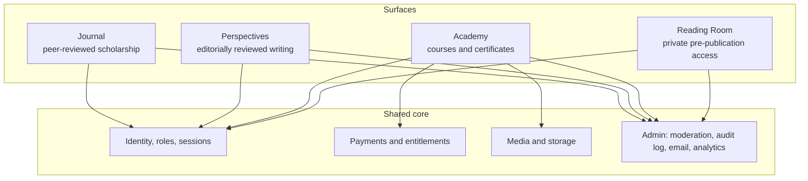

# Design study: a scholarly publishing platform that cannot lie about peer review

**Status:** in design. The architecture and build order are written; implementation has not started. This page is about decisions made *before* code, which is when they are cheapest to get right.

[← Portfolio home](../README.md)

---

## The problem

Academic publishing software is usually built for large institutions: heavy, server-hosted, expensive to operate. I publish scholarship through my own imprint and need something different: a **single platform** that holds peer-reviewed journal articles, editorially reviewed essays, courses, a private manuscript reading room and commerce, all behind **one identity system and one admin console**, run by one person on serverless infrastructure.

I evaluated the established open-source journal system and chose to build. The reason was not hosting cost. The combined product is the differentiator, and a system designed for the large-institution case is the wrong shape for it.

---

## Shape of the system



No containers, no cluster, no permanently running server, and no cache layer until a specific measured workload demands one.

---

## Three decisions that are protected from future convenience

### 1. Peer-reviewed and editorial content must never look equivalent

Not in the database, the URLs, the metadata, the labels or the policy. Separate tables, separate URL namespaces, separate metadata schemas, no shared "publication type" that conflates them. A visitor must be able to tell which is which **without reading a disclaimer.**

### 2. The peer-review badge is generated from records, not artwork

A badge is not an image someone attaches. It is rendered at request time from the actual review records and links to a public verification endpoint:

```
✓ PEER REVIEWED
  Review model: double-blind
  Independent reviewers: 2
  Editorial decision: accepted
  Version: version of record
  → verify this publication record
```

If the records do not exist, the badge cannot render. *A journal that cannot verify its own peer-review process is a website with a badge.*

### 3. One canonical course, many localized editions

A course is one record. Languages are editions attached to it, each with its own lessons, captions, transcripts, emails and certificate language. Multilingual content is first-class data, not a plugin, so adding a language never means forking a course.

---

## Engineering rules I wrote down before writing code

A selection of the twenty binding rules:

- Never misrepresent editorial review as peer review.
- Never silently mutate a published scholarly version.
- Never expose confidential manuscripts through public storage or direct URLs.
- Never provision paid content from client-side state.
- Every payment webhook is signature-verified **and** idempotent; payment state and entitlement state stay separate.
- Every certificate is publicly verifiable; revoked certificates stay on record and are never deleted.
- **AI never makes publication decisions, never becomes the final peer-review authority, and never receives private content silently.**
- Public scholarship must render and be indexable without JavaScript.
- Accessibility is an acceptance criterion, not a polish pass.
- *Do not add infrastructure because it looks impressive. Measure.*
- *Do not add a feature because another platform has it.*

## A build order that puts foundations first

Identity, roles, validation, audit log, feature flags, an admin shell and a formal migration system come **before** any public feature, and every feature ships with its admin interface in the same phase, so I never need to open a database console to run the operation.

An explicit **"what not to build"** list sits beside the roadmap: a social feed, private messaging, follower counts, recommendation algorithms, autonomous AI review. A roadmap that names its refusals is easier to trust.

I also intend to extract the publishing engine as an open-source package, but only **after** the platform has proven itself in production. Open source that has never carried real load is a hope, not a product.

[← Portfolio home](../README.md)
