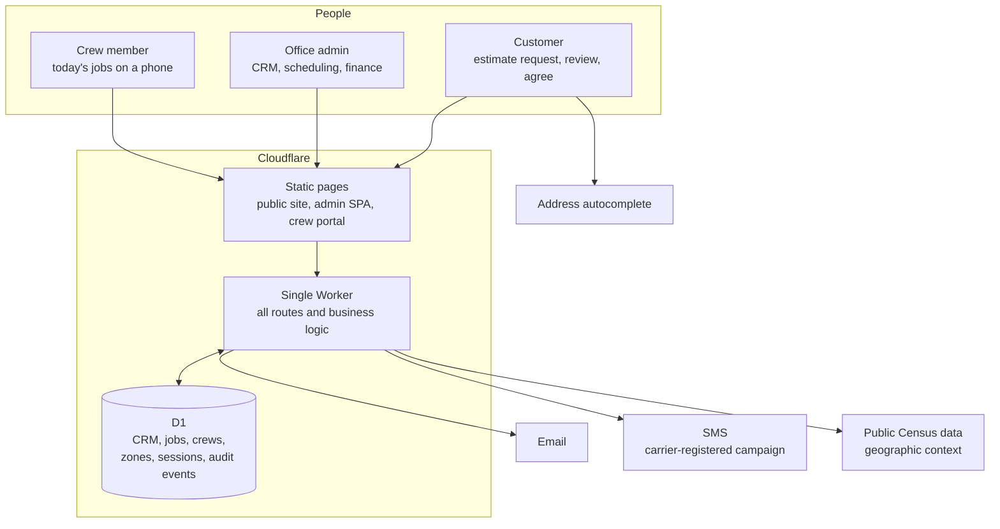

# Case study: web properties and a field-service operations platform

[← Portfolio home](../README.md)

---

## Part 1: A small fleet of production sites, one operating model

I run several production web properties on Cloudflare: a personal and professional site, a music-franchise site, a publishing imprint with its application, and our family company's platform. They share one discipline rather than one codebase.

| Property | Shape | Notes |
|---|---|---|
| Personal and professional site | ~20 hand-authored static pages | Shared stylesheet, no framework and a custom 404 |
| Music franchise site | Static site with a contact form | Publishes an AI-use disclosure page |
| Publishing imprint + SOUND Method | Three Workers + D1 + R2 | See the [SOUND Method case study](sound-method.md) |
| Private AI control plane | Worker + D1 + R2 + AI Gateway | See [ZION](zion-control-plane.md) |

What they have in common:

- **Git is the only path to production.** Commit, push to `main`, CI or the platform's Git integration deploys. Rollback is a `git revert`.
- **Every repo carries its own operating manual** (`CLAUDE.md` for AI collaborators, `ARCHITECTURE.md`, `CHANGELOG.md`) including a *migration path*: how I would leave this vendor and how long it would take. For the static site: copy one folder to any host, roughly an hour.
- **No dependency I cannot explain.** A third-party CDN script on a contact form once caused an outage; it was replaced by a few lines of plain `fetch`, and vendor libraries are now self-hosted with a manifest.
- **Transparency as a feature.** One site carries a public disclosure page stating exactly where AI tools were and were not used in my work: music, writing, teaching and code.

---

## Part 2: Florida Deep Cleaning operations platform (family business)

A complete operations system for [Florida Deep Cleaning](https://floridadeepcleaning.com), our family's home-cleaning company in the Tampa Bay area, replacing spreadsheets and text messages. It has three audiences, each with its own surface.

Decisions worth noting:

- **One Worker file, no framework.** Small deploy surface, near-zero cold start, and a single place to read to understand the system. The trade-off (a large file) is accepted and documented.
- **D1 as the only data store.** No separate cache, queue or database. All access goes through the Worker; the browser never touches the database.
- **Two different auth models for two different people.** Office staff use password sessions (PBKDF2, session tokens stored only as hashes, eight-hour expiry, a read-only role that blocks every non-GET request). Crew members use phone number plus PIN on a separate session table, because a crew member on a driveway does not want a password manager.
- **Public intake is guarded, not just validated:** honeypot fields, server-side validation, a service-area gate derived from geography rather than from what the user typed, and rate limits.
- **Estimates use public geographic data** to reflect local conditions. The pricing method itself is the company's confidential business logic and is intentionally not described here.
- **Trilingual hiring form** (English, Portuguese, Spanish) because the workforce is.
- **Payments are scoped to what v1 needs.** The original plan listed a second processor; the build deliberately diverged, and the governing plan carries a "read this first" note recording where and why. A plan that admits it has drifted is more useful than one that pretends it has not.
- **Separate Cloudflare account, separate repo, separate credentials** from all my other projects, by design.

[← Portfolio home](../README.md)
