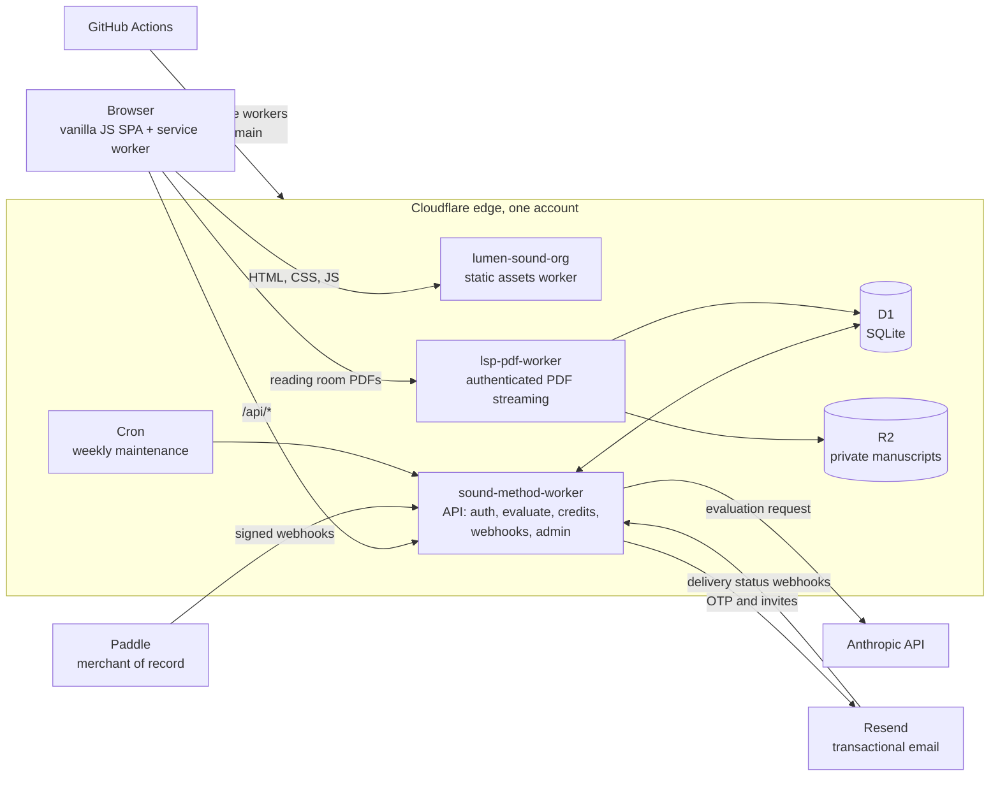
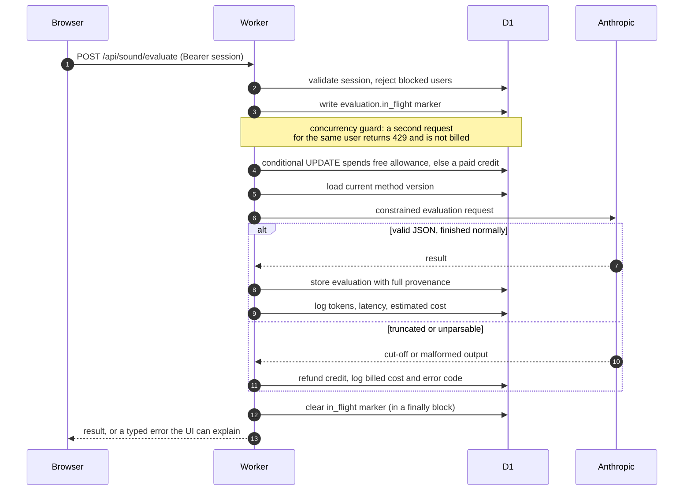
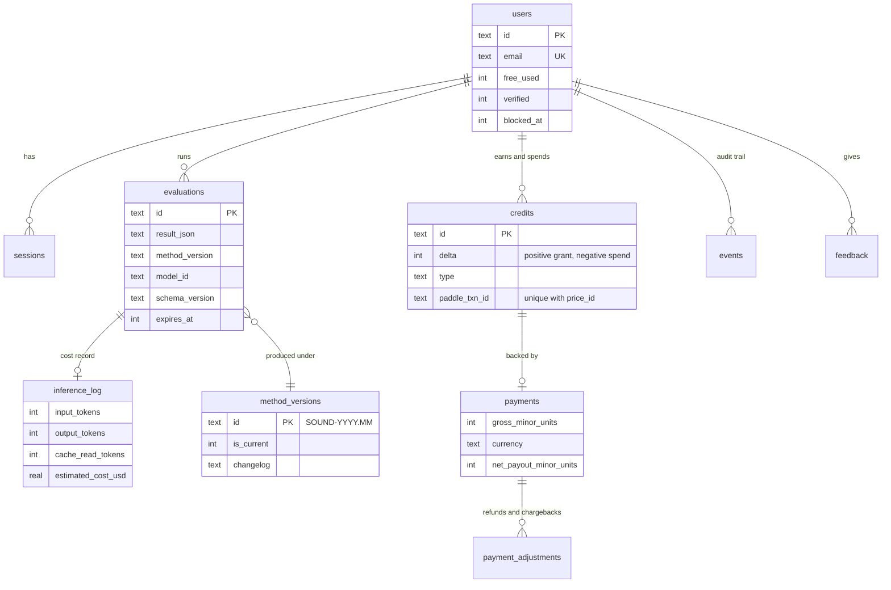
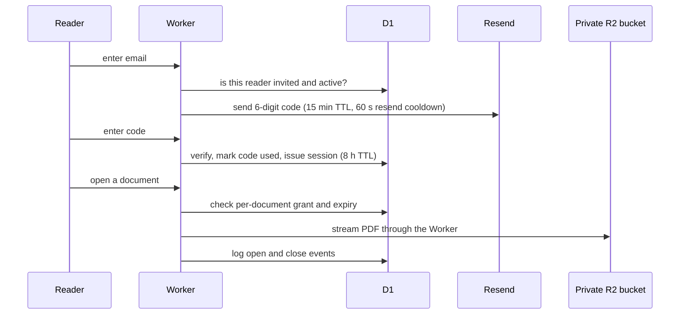

# Case study: SOUND Method, a production AI evaluation SaaS on Cloudflare's edge

**Status:** live beta (v0.17) · [lumensound.org/sound](https://lumensound.org/sound/)
**Stack:** Cloudflare Workers · D1 · R2 · Anthropic Claude API · Paddle · Resend · vanilla JS · GitHub Actions
**Built and operated by:** one person

[← Portfolio home](../README.md)

---

## What it is

SOUND Method evaluates congregational worship songs. A user submits a title and lyrics, and the app returns a structured, multi-criterion evaluation with a verdict, a weighted score, Scripture references, flagged phrases and suggested edits. It is sold in credit packs, with a small monthly free allowance.

The evaluation rubric is unpublished research and belongs to a forthcoming book, so it is deliberately not described here. This page is about the **engineering around the engine**: how a constrained LLM is made safe to put behind a cash register.

**The constraint that shaped everything:** one operator, real money, real users. There is nobody to hand an outage to. Every decision below trades cleverness for operability.

---

## System architecture



Three Workers, one database. The static site, the API and the PDF delivery path deploy and fail independently. Edge routing and the Worker's internal router are two separate registrations (see incident INC-010 below, which taught that lesson).

---

## The evaluation request, end to end

The hard part is not calling the model. It is everything that must be true **before** and **after** the call.



Design notes:

- **Credit spend is one conditional SQL statement**, not read-then-write, so two parallel requests cannot both spend the last credit.
- **Output parsing has three strategies** (direct, strip code fences, slice from first brace). If all fail, the user is refunded automatically and the failure is logged with its billed cost.
- **Every evaluation row carries provenance:** method version, prompt version, model id, schema version, app version, response locale. Any past result can be traced to exactly what produced it.
- **Errors are typed** (E001 to E009) so a support question becomes a lookup, not an investigation.

---

## Data model



Decisions embedded in the schema:

| Decision | Why |
|---|---|
| **Credits are a ledger** (signed `delta` rows), not a balance column | A balance can silently drift; a ledger can be audited and reconciled against Paddle. |
| **Money in minor units, currency-aware** | No floating-point money, ever. |
| **Payment state and entitlement state are separate tables** | A refund is a fact about money; clawing back credits is a policy applied to that fact. |
| **Financial records are never purged**, and survive user deletion (detached, not deleted) | Deleting a user must not erase the books. |
| **Lyrics are cleared after six months; telemetry events after one year** (weekly cron) | Data minimisation. Keep the result and the accounting, drop the raw input. |
| **The prompt lives in a versioned, admin-only table** and is never returned to clients | Method changes are a reviewed, reversible data change with a changelog, not a silent code edit. |
| **Unique index on `(paddle_txn_id, price_id)` + `INSERT OR IGNORE`** | Idempotency enforced by the database, not by hoping the code path runs once. |

---

## Payments: designing for the webhook that arrives twice (or never)

Paddle is the merchant of record, so tax and VAT across jurisdictions are its job rather than mine.

The webhook handler is built on four rules:

1. **Verify the signature** with a constant-time comparison, a five-minute timestamp tolerance, and support for multiple signature values so secrets can be rotated without downtime.
2. **Idempotent by construction.** Paddle retries for days on any non-2xx, with the same event id. A duplicate must be a no-op. Verified with concurrent duplicate deliveries.
3. **Fail loudly so the sender retries.** Unexpected errors return 500, not 200. Returning 200 on failure was an early bug: it told Paddle "done" while nothing had been credited.
4. **Refunds and chargebacks reclaim only unspent credits,** never below zero. Credits already used are recorded as a shortfall and flagged for a human. Ambiguous events (reversals, refunds for unknown transactions) are flagged, never auto-handled. Wrong code here is worse than no code.

---

## Reading Room: invitation-only access to pre-publication manuscripts

A separate surface for sharing manuscripts with invited reviewers before publication.



- **No public URL to any manuscript exists.** The bucket is reachable only through the Worker, which checks session and per-document grant on every request.
- **Grants are per document and can expire,** for example when a book is published.
- **Readers inactive for 30 days are deactivated** by the weekly job.
- **An admin console** manages invitations, revocation, and a per-reader activity feed, so access control never requires opening the database.

---

## Deployment: git is the only path to production

```
edit locally → commit → push to main → GitHub Actions → Cloudflare
```

This is a rule, not a preference, and it exists because of a real incident. A manual deploy once shipped code that git did not contain; the next CI run silently overwrote it and caused a production regression. Since then:

- No manual deploys, in any project. Preview locally with `wrangler dev`.
- Rollback is `git revert` and a normal push, never re-deploying an old build by hand.
- After every deploy, the version constant in the CI log is compared to the local one.
- Releases follow a checklist: version constants, release notes, changelog, version table, tracker.

---

## Incident ledger (what broke, why, and what changed)

Blameless post-mortems are part of the product. Selected entries, with identifying details removed:

| Incident | Root cause | What changed |
|---|---|---|
| **Double-submit charged several credits for one action** | Client: the mobile button was never disabled, and the spinner was hidden at that breakpoint. Server: the duplicate check ran *before* the result was written, so concurrent requests all passed. | Disable every control in the loading state. Write an `in_flight` marker *before* calling the model. Affected credits restored by hand. |
| **Live payments would never have credited** | The webhook signing secret was still the sandbox one after switching to live. Every delivery got a 401, so even the audit log looked empty. | Found by my own first real purchase. Blast-radius check confirmed it was the only transaction the account had ever processed. Environment cutover now includes re-setting the secret; a recurring canary transaction is planned. |
| **Email-status webhook dark for eight days** | The route existed in the Worker's router but was never registered at the edge, so requests 404'd upstream of any log. | Added the route. Lesson recorded: a new API route needs two registrations, and a `curl` against the live URL right after deploy would have caught it on day one. |
| **About 15% of evaluations failed to parse** | Output hit the token cap (live data: average about 3,000, maximum 4,088, cap 4,096), cutting the JSON mid-object. | Raised the cap, added a distinct truncation error code with automatic refund, and started logging the cost of failed calls, which had been invisible. |
| **PDF export silently dropped the verdict on long results** | The PDF library drops an unbreakable block taller than a page, without an error. | Reproduced with a stress test, restructured the layout, and recorded a rule: never wrap unbounded text in an unbreakable block, and assert that every section exists in the output. |
| **A fixed script never reached returning users** | The service worker was cache-first for everything, including app scripts. | Network-first for app code; cache-first only for immutable vendor assets and fonts. |
| **Duplicate credits possible on webhook retry** | Check-then-insert race found in a code audit, before it was ever exploited. | Unique index, `INSERT OR IGNORE`, and verification under concurrent duplicates. |

The recurring shape: **the defect is almost never where the symptom appears.** A parse error was a token budget. A 404 was a missing route registration. An empty audit log was a wrong secret.

---

## Client engineering

- **One HTML file per surface, no build step.** The app is a single-page vanilla JS application. No framework, no bundler, nothing between the source and what runs.
- **Design system:** semantic CSS tokens, one inline SVG icon sprite, Light/Dark/System themes resolved before first paint so there is no flash.
- **Mobile is a first-class shell,** not a squeezed desktop: bottom tab bar, bottom sheets, safe-area insets on every edge element, tested at iPhone SE width.
- **Import** from `.txt`, `.md`, `.rtf`, `.docx` and text `.pdf` with drag-and-drop, parsed in the browser with self-hosted libraries.
- **Typeset PDF export** (English on US Letter, Portuguese on A4) built from a pure function so it can be rendered and asserted in Node tests.
- **Self-hosted vendor files and fonts,** tracked in a manifest with a risk rating per dependency, after a third-party CDN failure took down a contact form.
- **Bilingual (EN / PT-BR)** by design. Localization infrastructure is treated as a prerequisite for new UI, not a retrofit.

---

## What I would do differently

- **Register edge routes and code routes from one source of truth.** Two registrations that can drift is a design smell.
- **Build the refund path before the purchase path.** Money going out deserves the same care as money coming in.
- **Introduce a live-payment canary on day one,** not after the first real purchase exposed the gap.
- **Write the regression test in the same commit as the fix,** without exception.

[← Portfolio home](../README.md) · [Engineering decisions →](../docs/engineering-decisions.md)
