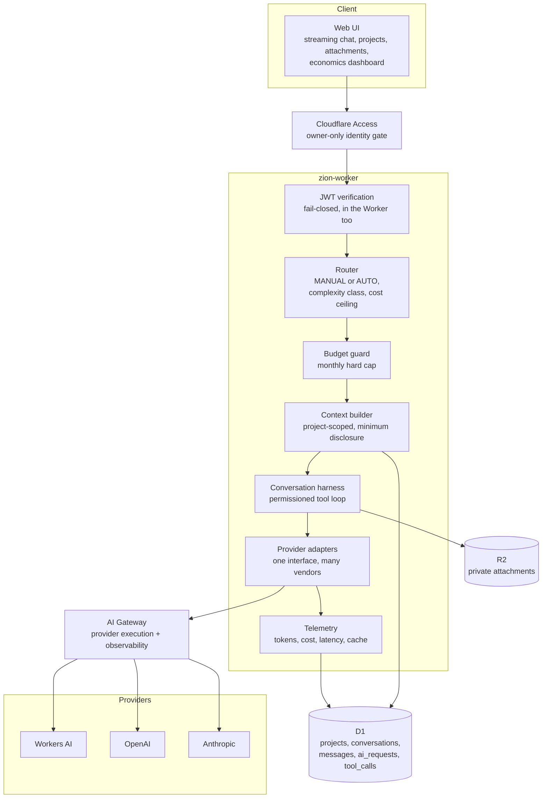
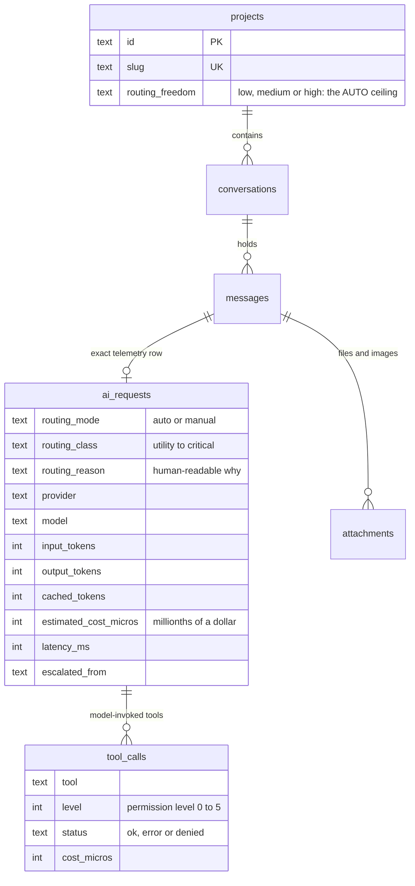

# Case study: ZION, a private AI control plane

**Status:** private, single-user, in daily use · Phase 1 complete, Phase 1.5 in progress
**Stack:** Cloudflare Workers (TypeScript) · D1 · R2 · AI Gateway · Cloudflare Access · Workers AI, OpenAI and Anthropic
**Source:** private repository. This page describes architecture and decisions, not code.

[← Portfolio home](../README.md)

---

## The idea

Most AI tools are a chat box bolted to one vendor. ZION starts from a different question: **what would a personal AI environment look like if the model were the most replaceable part?**

ZION is an orchestration layer I own. Models are interchangeable civil servants; the office (identity, project context, policy, budget, audit trail) outlives whoever currently holds it. Claude, GPT or an open-weights model can be swapped in without changing what ZION knows, what it is allowed to do, or what it costs.

It is not a product. It is how I work with AI every day, and therefore the most honest test bench I have.

---

## Architecture

**Separation of meaning from execution.** ZION owns identity, project policy, routing semantics, approvals and normalized telemetry. The gateway sits *beneath* ZION and owns provider execution. Project meaning never leaks into the vendor layer.

---

## Data structures

Notes:

- **Every assistant message links to the exact telemetry row that produced it,** so "what did that answer cost, and which model wrote it?" is one click in the UI, not a forensic exercise.
- **Cost is stored as integer millionths of a dollar,** and is NULL when pricing is unknown rather than guessed. Floats do not belong in a ledger.
- **A denied tool call is still a row.** The audit trail records what the model *tried* to do above its approved level, not only what ran.
- **One file is the only place model ids and prices live.** Adding or retiring a model is a one-file change with tests.

---

## Key engineering decisions

| Decision | Alternatives considered | Reasoning |
|---|---|---|
| **Fully cloud, no home server** | Always-on machine at home | No single point of failure that depends on my house. Decision recorded as an ADR. |
| **Route by deterministic rules first** | LLM-as-router | Routing that costs tokens to decide whether to spend tokens is self-defeating. A rule-based classifier plus a Low/Medium/High freedom ceiling, with one-hop escalation on provider failure. |
| **Hard monthly spend cap with owner alert** | Soft dashboard only | A runaway loop should hit a wall, not an invoice. |
| **Permission levels enforced by the tool registry, not the prompt** | "Tell the model to be careful" | Each tool declares a level; a run cannot call a tool above its approved level *whatever text says*, including text inside a fetched page or an attached file. Prompt injection is treated as a permissions problem, not a wording problem. |
| **Build vs. adopt, tested rather than argued** | Adopt a popular open-source chat platform | I ran the candidate locally, isolated, with throwaway keys and synthetic data, against the same scenario list as my own build. The finding narrowed the decision to a principle: *do not host a second stateful app; borrow its interface ideas.* |
| **Prompt caching on the stable system block** | No caching | Measured in production: the second request in a session cost about 92% less. |
| **Every attachment is untrusted input** | Trust uploaded documents | A file can inform the model; it can never instruct it or widen its tool permissions. |
| **Decisions are written as ADRs with the alternatives kept** | Decide and move on | Six months from now the reasoning matters more than the conclusion. There are fourteen so far, including ones that say "we tried it, it failed." |

---

## Epistemic discipline as a system feature

The part I am proudest of is not technical. ZION operates under a written constitution that binds every model it routes to. Its core rule is that every factual or technical claim carries a basis:

| Label | Meaning |
|---|---|
| **OBSERVED** | Directly verified from code, files, logs or sources |
| **DERIVED** | Follows logically from observed information |
| **INFERRED** | Reasonable interpretation, not established |
| **UNKNOWN** | The evidence is not there, and "unknown" is a valid answer |

Other binding rules: inspect before explaining; do not fill gaps with plausibility; no flattery; a benchmark score is not professional quality unless the measurement establishes that; quality is not reducible to cost.

The result is a system that tells me when it has not verified something, which is the property I value most in any collaborator, human or not.

---

## Evaluating models honestly

Before considering a model swap, the decision rule is written **before** any result exists:

- Same input, same context, one variable.
- Objective checks first (tests pass, exact strings, schema validity, planted facts at controlled depths), subjective scoring second.
- Blind by construction: arms are randomly labelled with a seeded key that stays hidden until scoring ends, and I then guess which was which, so the report states how blind it really was.
- The evaluator with a stake does not grade taste. Automated checks are frozen before outputs exist.
- Pre-registered thresholds, for example: no category more than a stated margin worse, zero secret leaks, zero fabricated citations. (A design that is written and frozen; the point is the discipline, not a leaderboard.)

---

## Lessons

1. **A stateless tool is a product bug, not a model bug.** My first image feature "understood nothing" because the engine only saw the last message. The fix was structural (give the tool the conversation), not a better model.
2. **Live-verify, don't just test.** Green tests did not catch a gateway that rejects streamed multipart bodies. A real request did.
3. **Write down what you did not verify.** Status pages here separate "passing tests" from "observed working in production" with a column for each.

[← Portfolio home](../README.md) · [Retired: ZION Music →](zion-music-retired.md)
