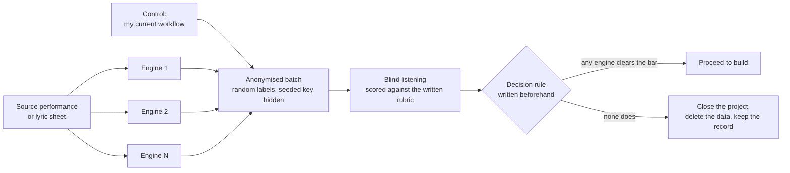

# Retired, not forgotten: ZION Music

**Status:** closed on purpose (September 2026) · **Outcome:** a clear "no", with the reasoning kept

[← Portfolio home](../README.md)

---

## Why this page exists

Most portfolios show only what worked. I think the decision to stop is an engineering skill, and I would rather show evidence of it than hide it.

ZION Music began as a planned extension of my private AI control plane: a surface for generating and arranging music with AI, sitting beside the rest of the system and inheriting its identity, policy and cost controls. I come from a career as a working musician and music director, so the question mattered to me personally.

---

## The real question

The first framing was "which AI makes the best song?" That is the wrong question, and I rewrote it before spending anything:

> **Can this replace the production workflow I already use, for the two kinds of music I actually make?**

| Track | What I bring | What the AI must do | How it is judged |
|---|---|---|---|
| **A: jazz, gospel, fusion** | About three minutes of my own piano or Rhodes performance | Arrange and produce around it | **Composition preserved first**, "would I release this?" last |
| **B: lyric-driven dance and fitness music** | Complete lyrics | Sing exact words, in style | Lyric fidelity, then release-worthiness |

The control was my existing workflow's output, a known quantity, not a synthetic benchmark.

---

## Design: a bounded, blind, cheap experiment

Constraints I set up front:

- **No cloud infrastructure** for the experiment. Local harness only, so a failed experiment leaves nothing to tear down.
- **A hard spend cap,** with costs reconciled at the end.
- **Multiple engines across different approaches,** including open-weights models on rented GPU time, so the result could not be blamed on one vendor's limits.
- **Blind scoring,** because I know which output I prefer by reputation, and reputation is not evidence.

---

## Result

Across several days and every engine I could responsibly test, none closed the gap to the workflow I already had. I closed the experiment once the evidence was in, without one more "just try the next model" round.

What I did next matters more than the verdict:

1. **Wrote the verdict and cost reconciliation into the project log,** including what was tried and why it failed.
2. **Deleted the harness, its tests and several gigabytes of generated data,** so the project does not carry a ghost feature, and kept the decision record.
3. **Left the door open:** the architecture decision records still describe where such a surface would plug in, should a future engine change the answer.

---

## What I took from it

- **Define "good enough" from your real workflow, not a leaderboard.** A general-audience preference score does not measure professional craft, and the two should never be confused.
- **A failed experiment with a written verdict is an asset.** An unfinished experiment with no verdict is a liability.
- **Kill cost should be designed in.** Because nothing was deployed, stopping cost nothing.
- **Do not let sunk cost vote.** The only input to the decision was the evidence.

Music remains central to everything I do. The lesson is narrower: *this* question, asked *this* way, had an answer, and the answer was no. I can re-ask it whenever the evidence changes.

[← Portfolio home](../README.md) · [ZION control plane](zion-control-plane.md)
