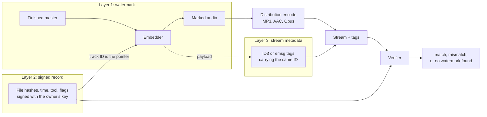
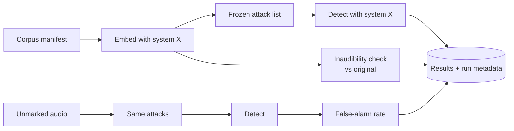

# Research in progress: ZionCodec, measuring how audio watermarks really fare

**Status:** pre-build. The threat model, claims rules and evaluation plan exist. **No embedder or detector exists yet, and nothing here is a result.** Everything below the research question is a proposal.

[← Portfolio home](../README.md)

---

## The question

> How much of a music-tuned watermark survives real distribution pipelines and neural-codec re-synthesis on finished audio, and what does a signed record plus a stream-metadata cross-check add when the watermark fails?

It marks audio **after** it is produced, so it works on any source, including AI-generated music, without depending on any generator.

I care about this because I produce and publish music and work with AI-assisted tools. Provenance for finished audio is a practical problem for people like me, and the honest answer to "does a watermark survive?" is currently a mix of vendor claims and narrow papers.

---

## The discipline matters more than the algorithm

This project has a written **claims policy that binds every README, report and commit message**. A few of its rules:

| Rule | Why |
|---|---|
| Claim a measurement and a tool, never a breakthrough | "Robust watermark" is marketing. "Detected in X% of N tracks after Y, at a false-alarm rate of Z" is a result. |
| **Freeze the attack list before seeing any result,** enforced by a test | Otherwise you tune the attacks to flatter the system. |
| **Publish the failures.** Expect neural re-synthesis to break a classical mark | A table of where it breaks is the useful output. |
| Run every baseline myself, under identical conditions | Never quote another paper's numbers as if they applied to my corpus. |
| Say what a watermark cannot prove | It shows a payload was embedded. It does not show who made the track. |
| One outside expert read before release | Comments go in the repo. |

And an explicit **out-of-scope list:** no testing removal of anyone else's watermark, no compliance claims, nothing described as "unremovable".

---

## Proposed architecture: three layers, each useful alone

The value is in the **cross-check.** When the watermark is lost, the other two layers still say something; when tags are stripped, the watermark still does:

| Watermark | Stream tags | Signed record | Reading |
|---|---|---|---|
| found | match | valid | Consistent with the owner's record |
| found | missing | valid | Tags likely stripped in transit |
| found | differ | valid | Tags spoofed or edited; trust the watermark |
| not found | present | valid | Watermark lost; tags alone are weak evidence |
| not found | missing | n/a | No evidence either way |

## The measuring stick is built first

The systems under test are mine and several published open-source ones, run under the same conditions. Every run records the git commit, attack-list hash, seeds, tool versions and corpus hash, so any row in a results table can be reproduced.

**Payload (proposal):** 80 bits before error correction: a version, a creator id, a track id, a few disclosure flags and a CRC to reject false detections. Capacity is measured per genre before it is fixed.

---

## Why I am sharing an unfinished project

Because the way I am running it is the point. The claims are smaller than the ambition on purpose, the failures are planned to be published, and the repository will stay private until a release checklist (including outside review) is complete. When there is a result, it will be linked here.

[← Portfolio home](../README.md)
